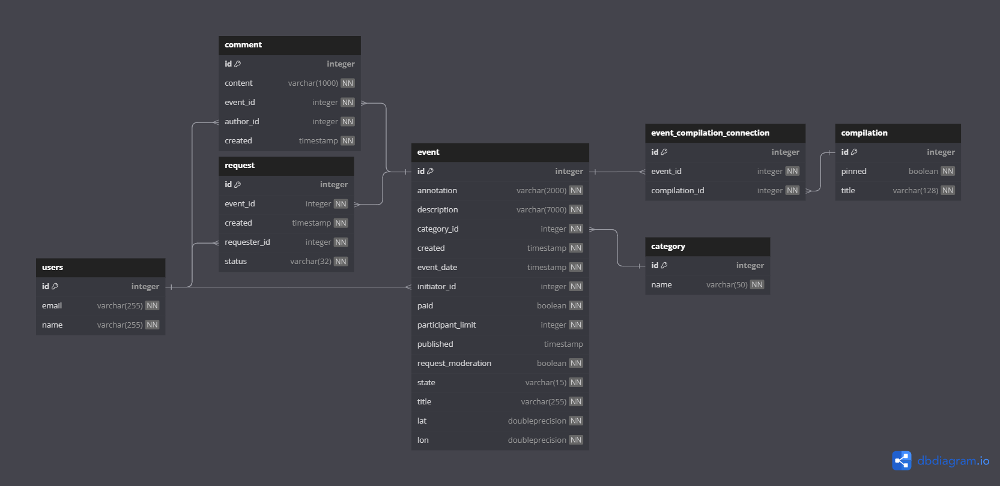

# Explore-with-me

## About
A RESTful web-service for posting and sharing events and find companions to participate in them. Users can post events, leave comments, register as participants, explore collections of events.

## Stack
Java, Spring Boot, PostgreSQL, JPA(Hibernate), Maven, Docker, Lombok.

## Architecture
_______________________________________________________________
Web-service consists of two docker microservises: main service(ewm-server) and statistics service(stat-server). 
Main service is divided into three parts: public, for authentificated users and andministrator endpoints.
Statistics service is divided into three micromodule:
- main service:
-     |public part
-     |for authentificated users part
-     |andministrator endpoints part
- statistics service: 
-     |micromodule Client
-     |micromodule Dto
-     |micromodule Server

The interaction of modules is made through RestTemplate;

The service is also ready for use on the Docker platform;
_______________________________________________________________

## Requirements
[Docker](https://www.docker.com/) is required as a minimum for the service to work, Linux system or WSL to run a service in a container. 

## Endpoints
- [Main service API](./ewm-stats-service-spec.json)
- [Statistics service API](./ewm-main-service-spec.json)

## DB schema of main api

### PR:
https://github.com/PriestSexist/java-explore-with-me/pull/4
